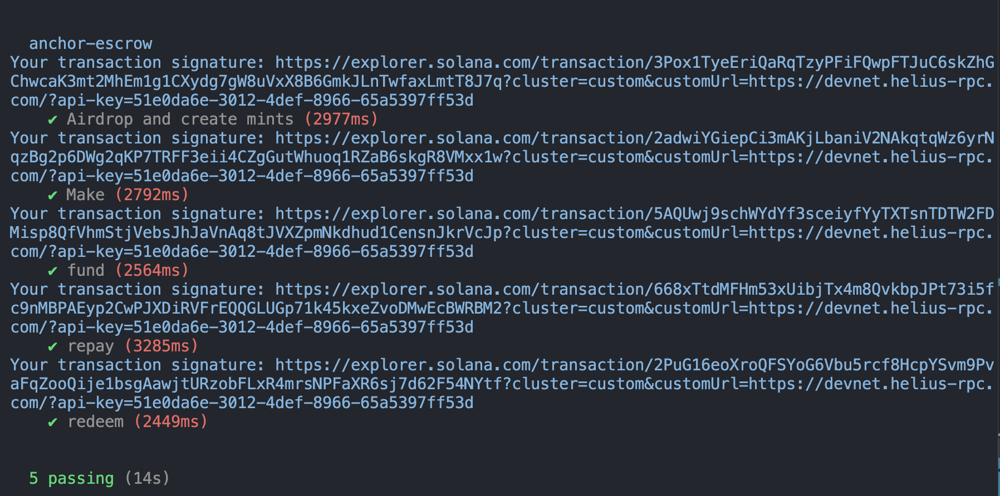

# Aspire
## Devnet prgram address
Deploying cluster: https://devnet.helius-rpc.com/?api-key=51e0da6e-3012-4def-8966-65a5397ff53d

Deploying program "aspire"

Program Id: 66vaBdJJQXqxdKTvpzRM6AnYDAZesSLvR7vVUo5fzBLz

Signature: https://solana.fm/tx/2xecudMQ8JskNePzw8MHLfbiAEpBioTMMfxYMQd2EDuF8JbCiyxmYxEW6CECQeoq9hdmLkg4K7D38TWYZVNqvnhz?cluster=devnet-alpha

## demo video
https://www.loom.com/share/d749b9159c3c4a4f905d4959f643ef61?sid=d5b1ca49-4b6a-4790-b5f2-67684b7b0b9b

## testing result



## description
- Aspire is a platform for whom is aspired for study abroad but needs financial supports.
Student can post their stories, and make funds from everyone onchain.
And after the students finish their degree, start to repay money back.
Also, it can connect students and funders.

## machanism
1. Students create the escrow, write down the interest rate, and wait for receive money.
The same time, they mint debt token, which means they own the funders money.
2. Funder can choose the student they trust and want to help and fund their escrow, then get debt token.
3. After the student finish his/her degree, start to repay money to the other escrow.
4. Funder can burn the debt token and get the funds back with interests.

## start
```yarn```
```anchor test```
And make sure there is enough sol in your devnet account